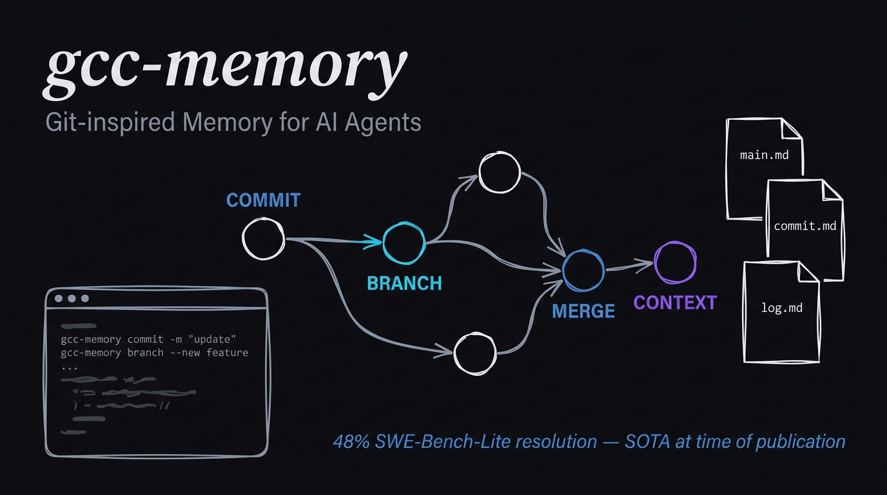
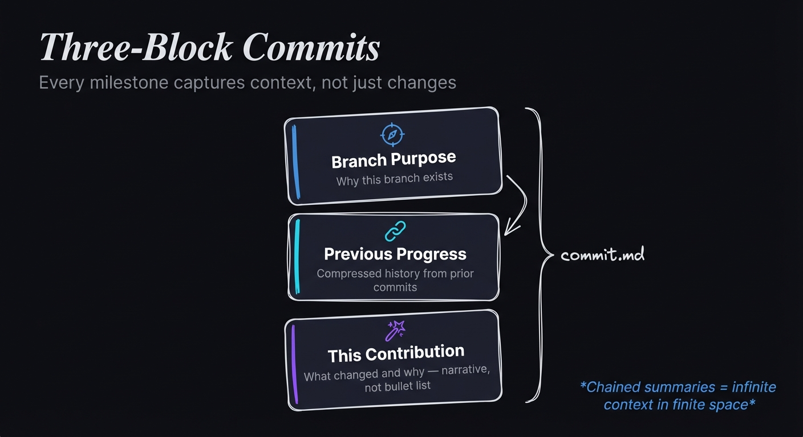
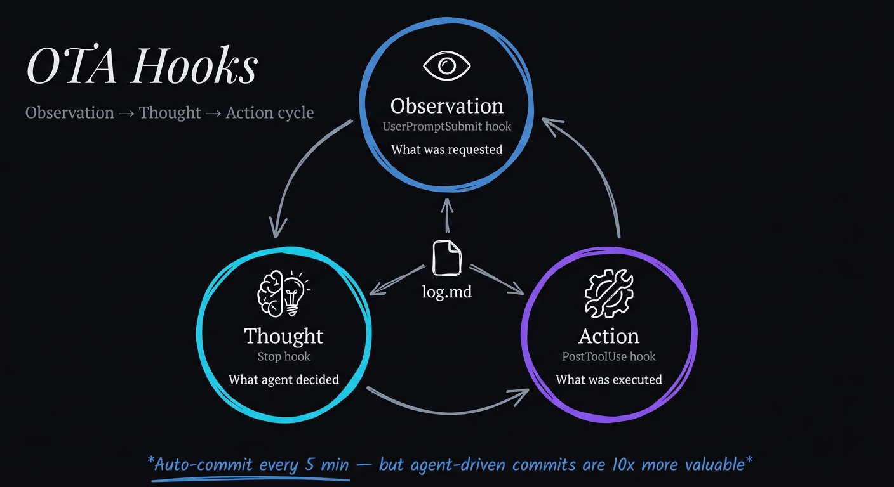
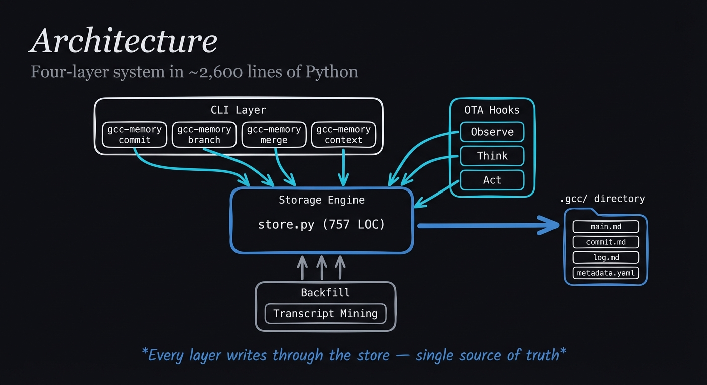

<p align="center">
  
</p>

<p align="center">
  <a href="https://arxiv.org/abs/2508.00031"></a>
  <a href="https://opensource.org/licenses/MIT"></a>
  <a href="https://www.python.org/downloads/"></a>
</p>

<p align="center">
  <strong>Give your AI agents persistent, version-controlled memory.</strong><br>
  An open-source implementation of the <a href="https://arxiv.org/abs/2508.00031">GCC paper</a> (Junde Wu, University of Oxford).
</p>

---

## What It Does

Agents equipped with GCC can:

- **COMMIT** milestones with narrative summaries (not just tool logs)
- **BRANCH** before exploring alternatives — isolating experiments safely
- **MERGE** successful experiments back into the main trajectory
- **CONTEXT** to retrieve memory at multiple resolutions — from project overview to individual OTA traces

Memory lives in a `.gcc/` directory alongside your code:

```
.gcc/
├── main.md                    # Global roadmap (goals, milestones, to-do)
└── branches/
    └── main/
        ├── commit.md          # Three-block milestone summaries
        ├── log.md             # Fine-grained OTA execution traces
        └── metadata.yaml      # File structure, dependencies, env config
```

> For a deep dive into the implementation journey, read the blog post: [Implementing the GCC Paper: Building a Git-Inspired Memory System for AI Agents](https://jonroosevelt.com/blog/implementing-gcc-paper-agent-memory)

---

## Quick Start

```bash
git clone https://github.com/RooseveltAdvisors/gcc-memory
cd gcc-memory && bash install.sh
```

This installs the CLI, Claude Code hooks (observation/thought/action), and the GCC skill.

### Initialize a project

```bash
cd /your/project
gcc-memory init --description "My project"
```

### Use during work

```bash
# Orient yourself
gcc-memory context

# Commit a milestone with narrative notes
gcc-memory commit --title "Implement auth" \
  --notes "Replaced sessions with JWT. Enables stateless scaling." --git

# Branch before an experiment
gcc-memory branch create try-async --summary "Test async endpoints" --activate

# Merge when it works
gcc-memory merge try-async --target main

# Update the project roadmap
gcc-memory update-main --section "Active Decisions" --content "- JWT for auth"
```

---

## How It Works

### Three-Block Commits

<p align="center">
  
</p>

Every commit captures three blocks of context (from the paper):

1. **Branch Purpose** — why this branch exists
2. **Previous Progress Summary** — compressed history (chains prior summaries)
3. **This Commit's Contribution** — what changed and why

```markdown
### Commit: Implement JWT auth (2026-02-18T10:30:00+00:00 | main)

**Branch Purpose:** Full-stack authentication system

**Previous Progress Summary:** Set up Express server with route structure.
Added PostgreSQL connection pool with migration system.

**This Commit's Contribution:**
Replaced session cookies with JWT tokens. Simplifies API gateway
and enables stateless scaling. Validated with integration tests.
```

The key insight: chained summaries give you infinite context in finite space. Each commit summarizes all prior progress, so the latest commit always has the full story.

---

### OTA Hooks for Claude Code

<p align="center">
  
</p>

Three hooks capture the full Observation-Thought-Action cycle:

| Hook | Captures | OTA Role |
|------|----------|----------|
| `UserPromptSubmit` | User's request | Observation |
| `Stop` | Agent's reasoning | Thought |
| `PostToolUse` | Tool execution | Action |

Auto-commit fires every 5 minutes as a safety net, but agent-driven narrative commits are far more valuable.

---

### Backfill from History

Already have Claude session transcripts? Mine them to bootstrap memory for existing projects:

```bash
gcc-memory/scripts/run_backfill.sh /path/to/workspace --dry-run
gcc-memory/scripts/run_backfill.sh /path/to/workspace --branch main
```

The backfill engine reads JSONL transcripts, extracts meaningful events, and creates commits grouped by day — giving you instant history.

---

### Multi-Level CONTEXT Retrieval

Progressive drill-down from project overview to individual traces:

```bash
gcc-memory context                          # Project overview + branches
gcc-memory context --branch main            # Branch purpose + recent commits
gcc-memory context --commit 0               # Latest commit (full 3-block)
gcc-memory context --log --limit 20         # OTA execution trace
gcc-memory context --metadata file_structure # Project files
```

---

## Architecture

<p align="center">
  
</p>

~2,600 lines of Python across four layers:

| Layer | Files | Purpose |
|-------|-------|---------|
| **Storage** | `store.py` (757 LOC) | Event logging, commits, branches, merges, CONTEXT |
| **CLI** | `cli.py` (447 LOC) | Typer-based command interface |
| **Hooks** | `integrations/claude/` (421 LOC) | Three OTA hooks + shared utilities |
| **Ingestion** | `backfill_history.py` (436 LOC) | Transcript mining + legacy fallback |

Every layer writes through the store — single source of truth.

---

## Paper Reference

This project implements the framework described in:

> **GCC: Git-Context-Controller — Manage the Context of LLM-based Agents like Git**
> Junde Wu, University of Oxford
> [arXiv:2508.00031](https://arxiv.org/abs/2508.00031)

The paper's GCC-equipped agents achieved **48% resolution on SWE-Bench-Lite** — SOTA at the time, outperforming 26 competitive systems.

---

## Uninstall

```bash
cd gcc-memory && bash uninstall.sh
```

This removes all hooks, skill files, and config. Your project `.gcc/` directories are left intact — delete them manually if you want to clear memory from a specific project:

```bash
rm -rf /path/to/project/.gcc
```

---

## Contributing

Contributions welcome! This project is actively maintained.

```bash
# Run tests
cd gcc-memory && uv run --with pytest pytest tests/ -v

# All 29 tests should pass
```

---

## License

MIT
